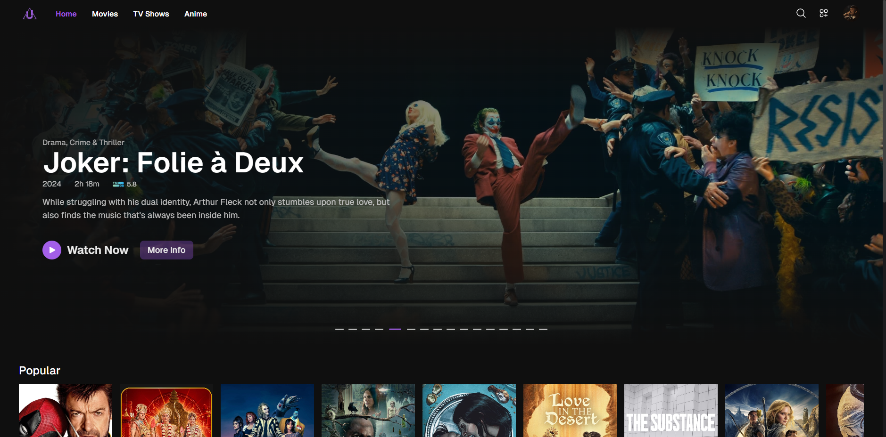

# UltimaTio - Your Ultimate Multimedia Platform

**UltimaTio** is a web-based multimedia platform where users can stream movies, TV series, and other media content. It offers personalized user experiences, allowing users to track their viewing progress, create playlists, and enjoy content across various devices. Whether you're a movie buff or a binge-watcher, **UltimaTio** has you covered with a sleek interface and powerful user features.

## Features

### 1. **Extensive Media Library**

- Access a vast collection of movies, TV shows, and other multimedia content.
- Content organized by genres, popularity, and personalized recommendations.

### 2. **User Accounts and Progress Tracking**

- Create and manage user profiles.
- Automatically save your progress on movies or episodes, so you can pick up where you left off at any time.
- Track recently watched media and receive personalized recommendations based on your viewing habits.

### 3. **Playlists and Watchlists**

- Create custom playlists and watchlists to organize your favorite content.
- Add movies, series, and episodes to your watchlist for later viewing.

### 4. **Multi-Device Support**

- Stream content seamlessly on desktop, tablet, or mobile devices.
- Responsive design ensures a smooth experience across all platforms.

### 5. **Advanced Search and Filtering**

- Powerful search functionality to quickly find movies, shows, or episodes.
- Filter content by genres, release dates, or user ratings.

### 6. **Play History and Resume Watching**

- Easily access your viewing history.
- Resume watching any movie or series episode right from where you last stopped, even after switching devices.

## Technology Stack

- **Frontend**: Next.js (React)
- **Backend**: Next.js (React)
- **Database**: Prisma ORM with PostgreSQL
- **Authentication**: JWT (User management)
- **Video Streaming**: External API's
- **Deployment**: Vercel
- **State Management**: Redux (for managing user states, watchlists, and viewing progress)

## How It Works

1. **User Registration and Login**:

   - Users can sign up or log in using secure authentication.
   - Profiles are personalized based on user preferences and watch history.

2. **Viewing Content**:

   - Browse or search for movies and series, add them to your playlists or watchlists, and start streaming with one click.
   - Media is streamed with adaptive bitrate to ensure optimal viewing quality on any device.

3. **Playlists and Progress**:

   - Create playlists of movies or episodes.
   - Your progress is automatically saved, and you can resume content across devices.

## Getting Started

1. Visit our live website: [UltimaTio](https://ultimatio-streaming-platform.vercel.app)
2. Search for your favorite movie or series and start streaming it!

## Future Features

- **Recommendation Engine**: Use AI to provide even more accurate recommendations based on viewing history.
- **Parental Controls**: Set up restricted profiles for younger users with content filtering.
- **Internationalization**: Provide multiple language support for global users.
- **Subtitles**: Add support for multiple subtitle languages.

## Contact

For any inquiries, feel free to reach me out at [alanbusinessnin@gmail.com](alanbusinessnin@gmail.com).
